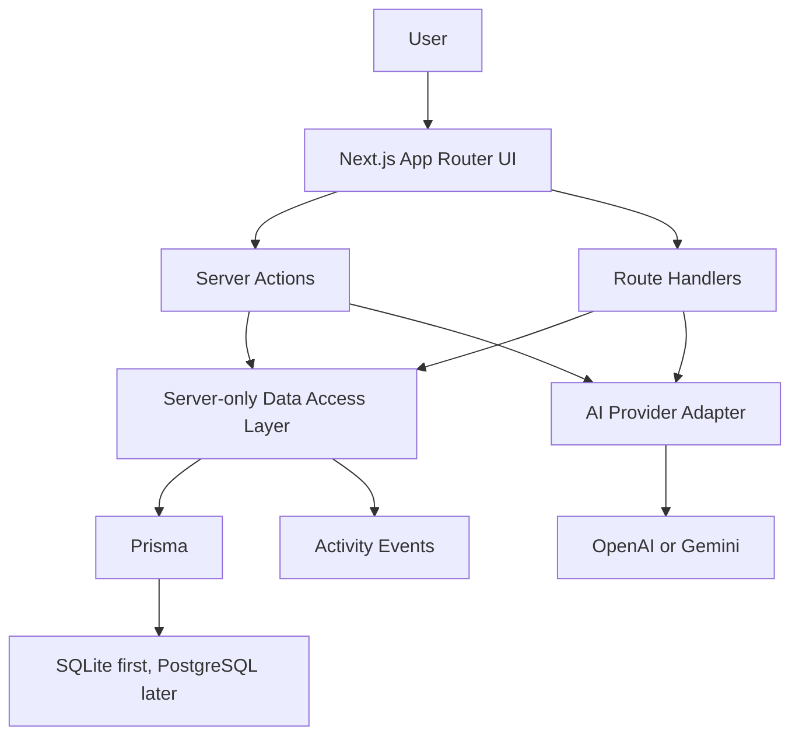

# System Architecture

LeadFlow AI is a modular Next.js App Router application. The UI, backend endpoints, server actions, and data access live in one codebase, but responsibilities must remain separated.

## Architectural Shape
Browser interactions enter through App Router pages, Client Components, Server Actions, and Route Handlers. Server-side code validates input, checks authentication, calls the Data Access Layer, records activities, and optionally calls AI services. Prisma persists business data. AI providers are behind an adapter so the CRM survives provider changes.

## Boundaries
- `app/` owns routing, layouts, loading states, errors, and API route handlers.
- `features/` owns feature-specific components, actions, schemas, services, and types.
- `lib/` owns shared server utilities, auth helpers, AI adapters, database clients, and cross-cutting helpers.
- `components/ui/` owns reusable UI primitives only.
- `docs/` owns decisions and implementation standards.

## Rules
- Server Components fetch display-ready DTOs.
- Client Components receive minimal props and handle interaction only.
- Route Handlers are for external-style HTTP boundaries or client APIs.
- Server Actions are for form and mutation workflows with explicit auth checks.
- AI calls never bypass validation, error mapping, or rate-limit planning.

## Prerequisites
- `AGENTS.md`
- `docs/03-adr/ADR-001-nextjs-app-router.md`

## Related Documents
- `docs/02-architecture/domain-model.md`
- `docs/02-architecture/data-flow.md`
- `docs/02-architecture/security.md`

## Used By
- All implementation agents
- Architecture review

## See Also
- `.mcp/skills/architect/SKILL.md`

## Implementation Notes
Do not collapse layers for speed. A prototype can still be clean.
